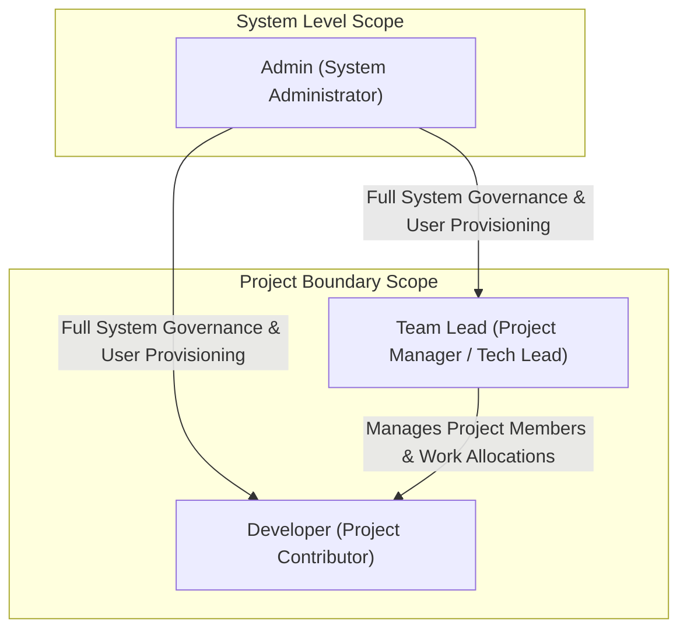
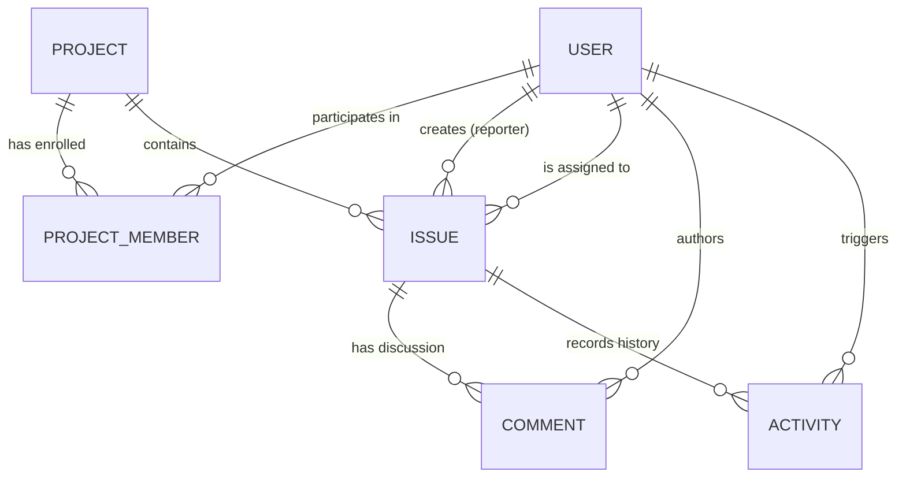
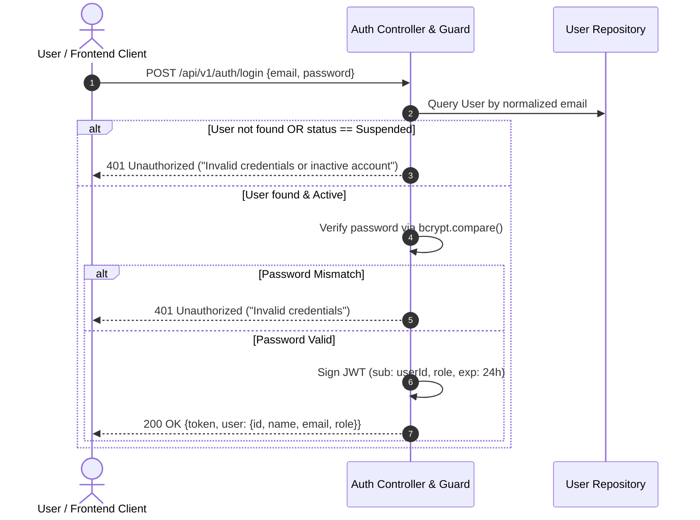
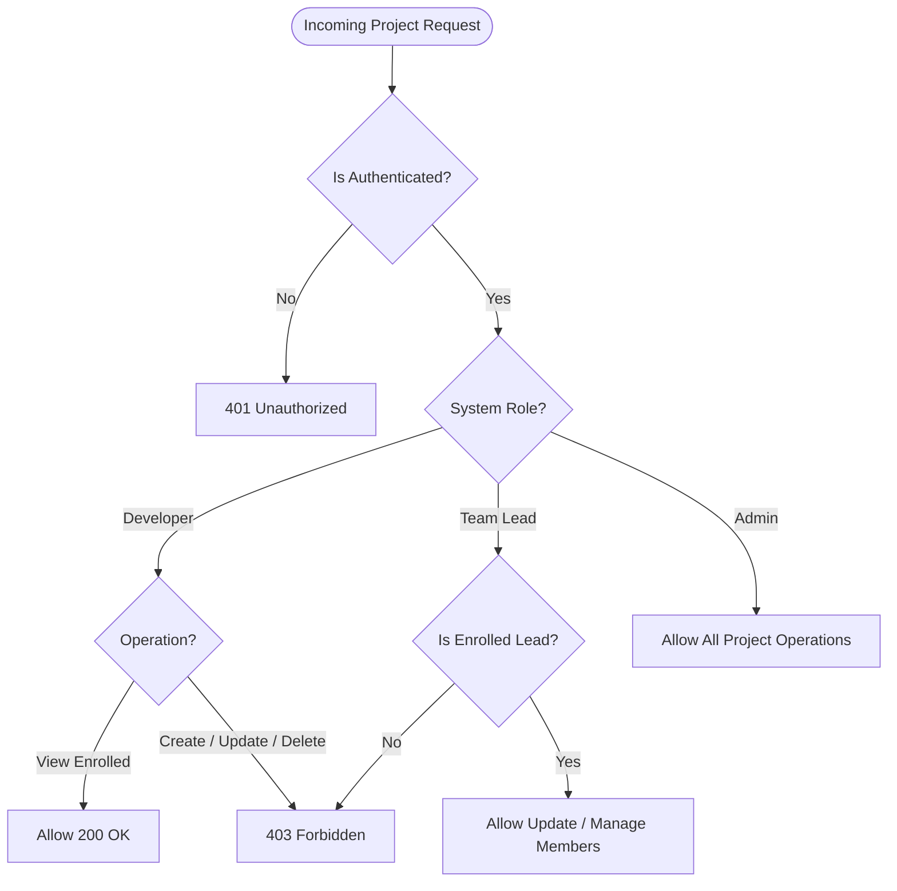
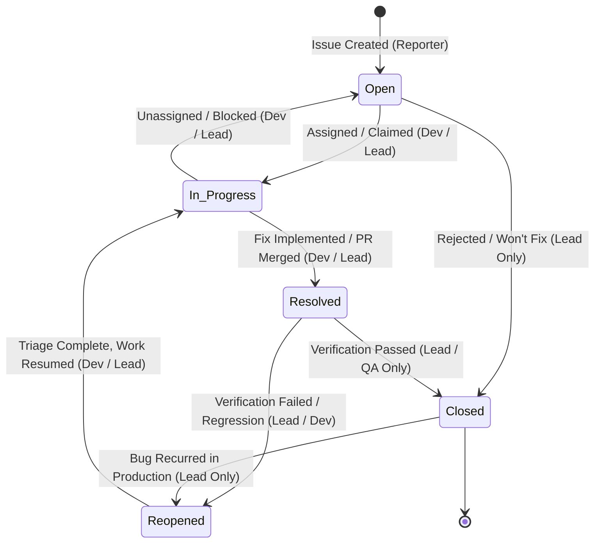
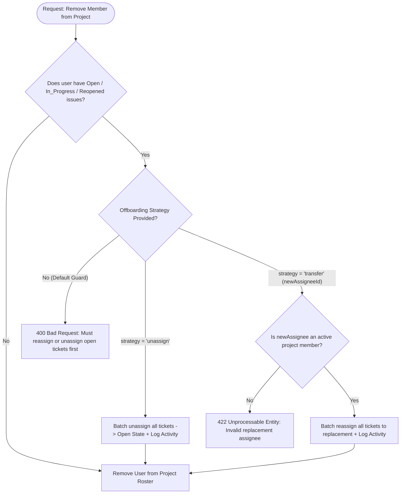

# DevSupport: Developer Issue & Incident Management System
## Phase 1: Requirements Engineering & Functional Specification

**Document Version:** 1.0.0  
**Status:** Approved for Architecture & Schema Design (Phase 2)  
**Author:** Senior Software Architect & Backend Engineering Lead  
**Target Stack:** Node.js, Express.js, MongoDB/Mongoose, React.js, JWT, bcrypt, Docker  

---

## Table of Contents

1. [Executive Summary & Project Objectives](#1-executive-summary--project-objectives)
2. [System Actors, Roles & RBAC Matrix](#2-system-actors-roles--rbac-matrix)
3. [Domain Entity Modeling & Responsibilities](#3-domain-entity-modeling--responsibilities)
4. [User Management & Authentication Requirements](#4-user-management--authentication-requirements)
5. [Project Management Requirements](#5-project-management-requirements)
6. [Issue Management Requirements & Lifecycle State Machine](#6-issue-management-requirements--lifecycle-state-machine)
7. [Issue Assignment, Reassignment & Member Offboarding](#7-issue-assignment-reassignment--member-offboarding)
8. [Comments & Collaborative Communication](#8-comments--collaborative-communication)
9. [Activity & Audit Trail Requirements](#9-activity--audit-trail-requirements)
10. [Querying, Searching, Filtering, Sorting & Pagination](#10-querying-searching-filtering-sorting--pagination)
11. [Non-Functional Requirements (NFRs) & Security Guardrails](#11-non-functional-requirements-nfrs--security-guardrails)
12. [API Error Contract & Failure Semantics](#12-api-error-contract--failure-semantics)
13. [Placement Interview Defense & Architectural Trade-offs](#13-placement-interview-defense--architectural-trade-offs)

---

## 1. Executive Summary & Project Objectives

### 1.1 Problem Statement
In modern multi-tier software engineering teams, issue reporting and incident response frequently degrade due to:
1. **Unstructured Bug Reports:** Incomplete defect descriptions lacking reproduction steps, environment context, and explicit severity.
2. **Opaque Ownership & Accountability:** Tickets idling unassigned or orphaned when engineers switch projects, leading to dropped SLAs.
3. **Ambiguous Lifecycle Transitions:** Premature closure of issues without verification, or zombie issues lingering in limbo.
4. **Audit Deficits:** Inability to inspect *who* changed priority, re-assigned an issue, or altered critical requirements during an active incident.
5. **No Segregation of Workspaces:** Uncontrolled cross-project access where unauthorized users can modify critical configuration or issue queues.

### 1.2 System Purpose
**DevSupport** is an enterprise-grade, multi-project Developer Issue and Incident Management System designed to govern the full lifecycle of software defects, engineering tasks, feature requests, and operational production incidents.

The system enforces:
- **Strict Role-Based Access Control (RBAC):** Hierarchical boundary enforcement across system-wide administration, project leadership, and developer contributions.
- **Project Isolation:** Strong multi-tenant data segmentation at the project boundary.
- **Deterministic State Machines:** Invariant-driven status transitions for bugs and production incidents.
- **Full Traceability:** Immutable audit logs capturing every mutation (state change, assignment change, comment, priority shift).
- **High-Performance Querying:** Predictable, indexed pagination, search, and multi-faceted filtering for high-throughput engineering teams.

### 1.3 V1 Feature Scope Justification
Every requirement in this specification is strictly justified by an operational need. No cosmetic or speculative features are admitted into Version 1.

| Feature Category | Included in V1 | Technical / Operational Justification |
| :--- | :--- | :--- |
| **Authentication & RBAC** | Yes | Required to guarantee non-repudiation, tenant isolation, and secure API execution. |
| **Project Workspaces** | Yes | Isolates codebases, team members, and backlog queues. |
| **Bug / Task / Feature / Incident Types** | Yes | Distinguishes routine tasks from critical production outages with different SLA urgency. |
| **Deterministic Lifecycle** | Yes | Prevents invalid states (e.g., closing an unverified bug, bypassing code review). |
| **Issue Assignment & Transfer** | Yes | Guarantees clear single-threaded owner accountability. |
| **Comments & Discussion** | Yes | Maintains contextual debugging history within the ticket itself. |
| **Immutable Activity Log** | Yes | Essential for incident post-mortems, compliance, and regression tracking. |
| **Search, Filter, Pagination** | Yes | Eliminates unbounded database queries and maintains sub-100ms response times on large datasets. |
| *Real-time WebSockets* | **No (Deferred to V2)** | Polling/standard REST is sufficient for V1; WebSocket state synchronization introduces distributed session complexity premature for baseline correctness. |
| *File Attachments / S3 Uploads* | **No (Deferred to V2)** | Binary blob storage requires presigned URL orchestration and antivirus pipelines; V1 focuses on pristine textual reproduction logs. |
| *Third-party OAuth / SSO* | **No (Deferred to V2)** | Email/password with bcrypt and stateless JWT provides complete baseline auth control without external IdP dependencies. |

---

## 2. System Actors, Roles & RBAC Matrix

DevSupport identifies three primary actors with distinct privilege boundaries:



### 2.1 Role Definitions

#### 2.1.1 Admin (System Administrator)
- **Scope:** Global / System-wide.
- **What an Admin CAN do:**
  - Create, view, update, deactivate, and reactivate any user account in the system.
  - Assign system roles (`Admin`, `Team Lead`, `Developer`) to users.
  - Create new projects and assign designated Team Leads to those projects.
  - View all projects, issues, comments, and audit logs across the entire system.
  - Archive or permanently delete projects (soft-deletion protocol).
  - Force-reassign issues in orphaned or emergency project states.
- **What an Admin CANNOT do:**
  - Cannot view plain-text passwords or alter password hashes directly (must trigger standard reset workflows).
  - Cannot bypass audit logging—all Admin actions are permanently recorded with the Admin's actor ID.
  - Cannot post comments under another user's identity (non-repudiation).

#### 2.1.2 Team Lead (Project Lead / Engineering Manager)
- **Scope:** Project-Scoped (applies only to projects where the user is enrolled as Lead/Manager).
- **What a Team Lead CAN do:**
  - Update metadata (name, description) of projects they lead.
  - Add registered Developers to their project membership roster.
  - Remove Developers from their project roster (with mandatory issue reassignment checks).
  - Create, edit, assign, reassign, and prioritize any issue within their project.
  - Execute full lifecycle transitions, including closing verified issues and reopening regressions.
  - Moderate or delete inappropriate comments on issues within their project.
  - View project-specific activity and audit trails.
- **What a Team Lead CANNOT do:**
  - Cannot access, view, or modify projects where they are not an enrolled member.
  - Cannot create global user accounts, deactivate users, or elevate users to Admin status.
  - Cannot delete projects (only request archival or rely on Admin).
  - Cannot remove the last Team Lead from a project without transferring ownership.

#### 2.1.3 Developer (Engineering Contributor)
- **Scope:** Project-Scoped (read-write inside assigned projects, restricted mutation rights).
- **What a Developer CAN do:**
  - View projects in which they are an enrolled member.
  - View all issues, comments, and activity logs within their enrolled projects.
  - Create new issues (Bugs, Tasks, Features, Incidents) within enrolled projects.
  - Self-assign unassigned issues (claim work).
  - Update description, reproduction steps, and technical notes on issues assigned to them or created by them.
  - Transition issue status according to Developer state rules (e.g., `Open` $\rightarrow$ `In Progress` $\rightarrow$ `Resolved`).
  - Add comments to any issue in their enrolled projects.
  - Edit or delete their own comments within an allowed grace window.
- **What a Developer CANNOT do:**
  - Cannot view or search projects they are not a member of.
  - Cannot add or remove members from a project.
  - Cannot reassign an issue away from another developer without Team Lead authorization.
  - Cannot close an issue directly (`Resolved` $\rightarrow$ `Closed` requires Team Lead / QA sign-off).
  - Cannot change issue priority on tickets assigned to others.
  - Cannot delete issues or modify immutable audit records.

---

### 2.2 Role-Based Access Control (RBAC) Matrix

| Domain Operation | Admin | Team Lead (In Assigned Project) | Team Lead (Non-Member Project) | Developer (In Assigned Project) | Developer (Non-Member Project) |
| :--- | :---: | :---: | :---: | :---: | :---: |
| **User: Register / Create** | Read/Write | Denied | Denied | Denied | Denied |
| **User: Deactivate / Reactivate** | Yes | Denied | Denied | Denied | Denied |
| **User: Change Role** | Yes | Denied | Denied | Denied | Denied |
| **User: View User Directory** | Yes | Yes (Active only) | Yes (Active only) | Yes (Active only) | Yes (Active only) |
| **Project: Create** | Yes | Yes (Configurable) | Denied | Denied | Denied |
| **Project: View Details / Listing** | All Projects | Enrolled Only | Denied | Enrolled Only | Denied |
| **Project: Update Metadata** | Yes | Enrolled Only | Denied | Denied | Denied |
| **Project: Add / Remove Members** | Yes | Enrolled Only | Denied | Denied | Denied |
| **Project: Archive / Soft Delete** | Yes | Enrolled Only | Denied | Denied | Denied |
| **Issue: Create** | Yes | Enrolled Only | Denied | Enrolled Only | Denied |
| **Issue: View & Search** | All | Enrolled Only | Denied | Enrolled Only | Denied |
| **Issue: Assign to Others** | Yes | Enrolled Only | Denied | Denied | Denied |
| **Issue: Self-Assign / Claim** | Yes | Yes | Denied | Enrolled Only (If Unassigned) | Denied |
| **Issue: Change Priority / Type** | Yes | Enrolled Only | Denied | Creator/Assignee Only | Denied |
| **Issue: Transition (`Open` $\rightarrow$ `In Progress`)** | Yes | Enrolled Only | Denied | Assignee Only | Denied |
| **Issue: Transition (`In Progress` $\rightarrow$ `Resolved`)** | Yes | Enrolled Only | Denied | Assignee Only | Denied |
| **Issue: Transition (`Resolved` $\rightarrow$ `Closed`)** | Yes | Enrolled Only | Denied | Denied | Denied |
| **Issue: Transition (`Closed` $\rightarrow$ `Reopened`)** | Yes | Enrolled Only | Denied | Denied | Denied |
| **Issue: Delete** | Yes | Enrolled Only | Denied | Denied | Denied |
| **Comment: Create** | Yes | Enrolled Only | Denied | Enrolled Only | Denied |
| **Comment: Edit / Delete Own** | Yes | Yes | Denied | Yes | Denied |
| **Comment: Delete Others' (Moderate)** | Yes | Enrolled Only | Denied | Denied | Denied |
| **Activity / Audit Log: View** | Global Logs | Project Logs | Denied | Project Logs | Denied |

---

## 3. Domain Entity Modeling & Responsibilities

The domain model contains five core entities for Version 1. Below is the strict architectural domain breakdown (conceptual, implementation-agnostic).



### 3.1 Entity Analysis

#### 3.1.1 User Entity
1. **Why It Exists:** Represents a distinct human individual interacting with DevSupport. Acts as the principal identity for authentication, authorization, accountability, and session validation.
2. **Core Responsibilities:**
   - Holds security credentials (email, hashed password, salt).
   - Holds system-level role (`Admin`, `Team Lead`, `Developer`).
   - Maintains account state (`Active`, `Suspended`).
   - Provides principal identity for audit attribution.
3. **Interactions:**
   - Associated with `Project` through project membership associations.
   - Associated with `Issue` as `reporter` and `assignee`.
   - Associated with `Comment` as `author`.
   - Associated with `Activity` as `actor`.
4. **V1 Essentiality:** **Mandatory (P0).** Without a User entity, RBAC and audit attribution cannot exist.

#### 3.1.2 Project Entity
1. **Why It Exists:** Serves as the organizational container and security boundary for all software engineering efforts, repositories, and incident queues.
2. **Core Responsibilities:**
   - Encapsulates project identity: unique name, short project key/prefix (e.g., `CORE`, `AUTH`, `PAY`).
   - Enforces membership boundaries (roster of allowed Team Leads and Developers).
   - Tracks project lifecycle status (`Active`, `Archived`).
   - Acts as the root partition for issues and audit records.
3. **Interactions:**
   - Interacts with `User` via membership rosters.
   - Interacts with `Issue` as the 1-to-many parent container.
   - Interacts with `Activity` as a logging scope.
4. **V1 Essentiality:** **Mandatory (P0).** Multi-tenant enterprise systems require bounded contexts so issues from different teams never bleed together.

#### 3.1.3 Issue Entity
1. **Why It Exists:** Represents the atomic unit of engineering work, bug report, feature request, or live operational incident.
2. **Core Responsibilities:**
   - Tracks unique identifier (e.g., `PAY-104`).
   - Enforces issue taxonomy: Type (`Bug`, `Feature`, `Task`, `Incident`), Priority (`Low`, `Medium`, `High`, `Critical`), and Status (`Open`, `In Progress`, `Resolved`, `Closed`, `Reopened`).
   - Holds descriptive data: Title, reproduction steps, technical notes, environment details.
   - Binds the issue to a designated reporter, current assignee, and parent project.
3. **Interactions:**
   - Belongs to one `Project`.
   - Reported by one `User`.
   - Assigned to zero or one `User` (within the project roster).
   - Parent to zero or many `Comment` entities.
   - Subject of zero or many `Activity` log entries.
4. **V1 Essentiality:** **Mandatory (P0).** This is the core business entity of the entire platform.

#### 3.1.4 Comment Entity
1. **Why It Exists:** Provides a chronological, collaborative dialogue thread directly anchored to a specific issue.
2. **Core Responsibilities:**
   - Captures contextual findings, debugging logs, stack traces, and resolution discussions.
   - Attributes content strictly to an authoring `User` and specific `Issue`.
   - Preserves message creation timestamp and edit status (`isEdited`).
3. **Interactions:**
   - Belongs to exactly one `Issue`.
   - Authored by exactly one `User`.
   - Emits an `Activity` record when posted or edited.
4. **V1 Essentiality:** **Mandatory (P0).** Distributed engineering teams cannot resolve issues without contextual in-ticket discussion.

#### 3.1.5 Activity (Audit Log) Entity
1. **Why It Exists:** Guarantees absolute transparency, compliance, and non-repudiation by preserving an append-only, tamper-proof chronological history of all mutations.
2. **Core Responsibilities:**
   - Captures what changed, who changed it, when it changed, and what the previous and new values were.
   - Tracks events: status transitions, reassignments, priority changes, comment creations, and project membership updates.
   - Remains strictly immutable (no updates or deletions permitted under any circumstance).
3. **Interactions:**
   - Points to a target `Issue` or `Project`.
   - References the triggering `User` (actor).
4. **V1 Essentiality:** **Mandatory (P0).** Production incident analysis and enterprise compliance require auditability.

---

## 4. User Management & Authentication Requirements



### 4.1 Registration Requirements
- **Input Parameters:**
  - `name`: String, non-empty, trimmed, min 2 chars, max 60 chars.
  - `email`: String, valid RFC 5322 email format, normalized to lowercase.
  - `password`: String, min 8 chars, max 64 chars, containing at least 1 uppercase letter, 1 lowercase letter, 1 numeric digit, and 1 special symbol (`!@#$%^&*`).
  - `role`: Optional during open registration (defaults to `Developer`). Only an existing `Admin` can provision `Team Lead` or `Admin` accounts directly.
- **Validation Rules & Invariants:**
  - Email uniqueness must be strictly enforced with case-insensitivity.
  - Plain-text passwords must **never** be persisted or logged. Must be hashed using bcrypt with a work factor (salt rounds) of at least 12.
- **Duplicate Email Behavior:**
  - If a registration request submits an email that already exists:
    - HTTP Status: `409 Conflict`.
    - Error Response: Generic, sanitized message: `"An account with this email address already exists."`
    - Invariant: No user data or account existence details beyond this error message may be leaked.

### 4.2 Login Requirements
- **Input Parameters:** `email` (normalized to lowercase), `password`.
- **Validation & Credential Handling:**
  - Look up user record by email.
  - If user does not exist or password comparison fails:
    - Return `401 Unauthorized`.
    - Message: `"Invalid email or password."` (Timing-safe comparison; generic message prevents account enumeration).
- **Inactive / Suspended User Handling:**
  - If user exists but `status == "Suspended"`:
    - Immediately reject before or after credential verification with `403 Forbidden`.
    - Message: `"Your account has been deactivated. Contact your system administrator."`
- **Successful Authentication:**
  - Issue a cryptographically signed JSON Web Token (JWT).
  - **JWT Payload Requirements:**
    - `sub`: User ID
    - `role`: System Role (`Admin`, `Team Lead`, `Developer`)
    - `iss`: `"DevSupport-API"`
    - `iat`: Issued-at timestamp
    - `exp`: Expiration timestamp (strict short-to-medium lifespan, e.g., 8 to 24 hours for V1).
  - Return user profile summary (omitting sensitive hash): `{ id, name, email, role, status }`.

### 4.3 Authenticated Identity (`/me`)
- Any request bearing a valid JWT in the HTTP header (`Authorization: Bearer <token>`) must be able to fetch the caller's current profile.
- Token validation must inspect:
  1. Cryptographic signature integrity.
  2. Token expiration (`exp`).
  3. Live database status of user (if user was deactivated after token was issued, the request must fail with `401 Unauthorized`).

### 4.4 Logout Semantics
- In a stateless JWT architecture for V1:
  - Client-side: Client explicitly deletes the stored token from storage (`localStorage` / secure memory / HTTP-only cookie).
  - Server-side: DevSupport specifies an endpoint `POST /api/v1/auth/logout` that returns `200 OK` confirming clearance.
  - Architectural Note for V2: Blacklist / revocation token cache (Redis) will be introduced if instant revocation prior to `exp` is required.

---

## 5. Project Management Requirements

### 5.1 Project Attributes & Constraints
- `name`: String, 3–80 characters, unique per system.
- `key`: String, 2–10 characters, uppercase alphanumeric (e.g., `PROJ`, `INFRA`, `API`). Immutable once created. Used as prefix for issue identifiers.
- `description`: String, up to 1000 characters.
- `owner`: Reference to a User with role `Team Lead` or `Admin`.
- `status`: Enum (`Active`, `Archived`). Defaults to `Active`.
- `members`: Set of User associations, each with an assigned project-level capacity (`Lead`, `Developer`).

### 5.2 Project Operations & Authorization Rules



#### 5.2.1 Project Creation
- **Allowed Actors:** `Admin`, or `Team Lead` (if system policy permits lead-initiated provisioning).
- **Preconditions:**
  - Project `name` and `key` must be globally unique.
  - Project `key` must be valid uppercase alphanumeric format (regex: `^[A-Z][A-Z0-9]{1,9}$`).
- **Postconditions:**
  - Creator is automatically added to the project roster as `Lead`.
  - Initial `status` is set to `Active`.
  - An activity log event `PROJECT_CREATED` is emitted.

#### 5.2.2 Project Viewing
- **Listing Projects:**
  - `Admin`: Can list all projects across the platform, with optional filters (`status=Active`).
  - `Team Lead` / `Developer`: Query returns **only** projects in which the caller is an enrolled member.
- **Single Project Detail:**
  - Non-members attempting to view project details must receive `403 Forbidden` (or `404 Not Found` to prevent project existence probing).

#### 5.2.3 Project Updating
- **Allowed Actors:** System `Admin`, or the enrolled `Team Lead` / Project Owner.
- **Allowed Modifications:** `name`, `description`. The project `key` is immutable to maintain issue ID integrity.
- **Unauthorized Attempt:** Returns `403 Forbidden`.

#### 5.2.4 Project Membership Management (Adding & Removing Members)
- **Allowed Actors:** System `Admin`, or the enrolled `Team Lead`.
- **Adding a Member:**
  - Target user must exist in the system and be in `Active` status.
  - Target user cannot already be an active member of the project (duplicate membership returns `409 Conflict`).
  - System logs `PROJECT_MEMBER_ADDED` with actor ID and target user ID.
- **Removing a Member:**
  - Target user must currently be an enrolled member.
  - Target user cannot be the sole remaining `Lead` / Owner of the project (ownership transfer required first).
  - **Issue Safety Check:** Refer to Section 7 for the mandatory handling of open assigned issues prior to member removal.
  - System logs `PROJECT_MEMBER_REMOVED`.

#### 5.2.5 Project Archival / Deletion Semantics
- **Archival (Soft-Delete):**
  - Allowed Actors: `Admin`, or Project `Lead`.
  - Setting `status = "Archived"` freezes the project:
    - All issues become read-only.
    - No new issues, comments, or status transitions may occur.
    - Preserves historical records for audits, regressions, and analytics.
- **Hard Deletion:**
  - Prohibited for standard users.
  - Admin-only operation under strict preconditions (e.g., zero active issues, or explicit cascade confirmation). Default policy: **Soft-delete / Archival is strongly preferred.**

---

## 6. Issue Management Requirements & Lifecycle State Machine

An Issue is the primary operational entity in DevSupport. It must adhere to strict type classifications, priority matrices, and a mathematically deterministic finite state machine.

### 6.1 Issue Classification Taxonomy

#### 6.1.1 Issue Types
1. **Bug:** Unintended defect, software regression, or crash in existing software causing unexpected behavior or incorrect output.
2. **Feature:** Novel functionality, enhancement, or capability being requested or developed.
3. **Task:** Technical or operational work item (e.g., database indexing, refactoring, dependency upgrades) that does not introduce a user-facing feature or fix a specific functional defect.
4. **Incident:** Critical live production outage, security breach, severe performance degradation, or data loss event requiring immediate triage and coordinated incident response.

#### 6.1.2 Priority Levels & SLA Urgency
1. **Low:** Minor defect, cosmetic UI flaw, or deferred task. No operational disruption. Work scheduled during standard backlogs.
2. **Medium:** Standard functional issue or normal sprint task. Workaround exists; system operates with minor friction.
3. **High:** Major functional impairment affecting critical business paths. No reasonable workaround. High urgency for upcoming or current sprint.
4. **Critical:** Severe production outage, systemic failure, or security compromise. Immediate all-hands escalation; triggers active incident protocol.

---

### 6.2 Deterministic Issue Lifecycle State Machine



### 6.3 State Transition Matrix & Invariants

| Transition | From State | To State | Permitted Roles | Preconditions & System Invariants | Audit Event Emitted |
| :--- | :--- | :--- | :--- | :--- | :--- |
| **T1: Begin Work** | `Open` | `In_Progress` | Assignee, Team Lead, Admin | Issue **must have an assignee**. If unassigned, developer must self-assign concurrently. | `STATUS_CHANGED (Open -> In_Progress)` |
| **T2: Relinquish / Block** | `In_Progress` | `Open` | Assignee, Team Lead, Admin | Work stopped or unassigned. Reason must be documented in comments. | `STATUS_CHANGED (In_Progress -> Open)` |
| **T3: Resolve** | `In_Progress` | `Resolved` | Assignee, Team Lead, Admin | Fix deployed to test/staging; test evidence or resolution summary provided. | `STATUS_CHANGED (In_Progress -> Resolved)` |
| **T4: Verify & Close** | `Resolved` | `Closed` | Team Lead, Admin | **Strict Invariant: Assignee (Developer) CANNOT close their own ticket.** Requires independent verification by Team Lead. | `STATUS_CHANGED (Resolved -> Closed)` |
| **T5: Reject / Discard** | `Open` | `Closed` | Team Lead, Admin | Issue marked as Duplicate, Invalid, or Won't Fix. Requires explanatory comment. | `STATUS_CHANGED (Open -> Closed)` |
| **T6: Verification Failed** | `Resolved` | `Reopened` | Team Lead, Developer, Admin | Test failed in staging or verification rejected. Ticket returns to active queue. | `STATUS_CHANGED (Resolved -> Reopened)` |
| **T7: Reopen Closed** | `Closed` | `Reopened` | Team Lead, Admin | Defect recurred in production. Developers cannot unilaterally reopen closed tickets. | `STATUS_CHANGED (Closed -> Reopened)` |
| **T8: Resume Reopened** | `Reopened` | `In_Progress` | Assignee, Team Lead, Admin | Engineer resumes debugging/implementation. Must have an active assignee. | `STATUS_CHANGED (Reopened -> In_Progress)` |

#### Justification for Extended Lifecycle (`Reopened` and Role-Restricted `Closed`)
- Standard simplistic bug trackers allow developers to move tickets directly from `Open` to `Closed`. In enterprise environments, this causes unverified code to ship to production.
- Requiring `Resolved` as a mandatory intermediate gate enforces peer review and QA verification.
- Having a distinct `Reopened` state is critical for engineering metrics (Defect Escape Rate, First-Time-Right percentage, and regression tracking).

---

## 7. Issue Assignment, Reassignment & Member Offboarding

### 7.1 Issue Creation Rules
- **Allowed Creators:** Any enrolled member of the project (`Developer`, `Team Lead`) and system `Admin`.
- **Mandatory Fields on Creation:**
  - `title`: String, 5–150 characters, trimmed.
  - `description`: String, 10–5000 characters.
  - `type`: Enum (`Bug`, `Feature`, `Task`, `Incident`).
  - `priority`: Enum (`Low`, `Medium`, `High`, `Critical`). Defaults to `Medium`.
- **Optional Fields on Creation:**
  - `assigneeId`: Optional. If omitted, issue enters the `Open` state as **Unassigned**.

### 7.2 Assignment & Reassignment Rules
- **Who Can Assign:**
  - `Team Lead` & `Admin`: Can assign or reassign any issue in the project to any eligible member.
  - `Developer`: Can **only self-assign** an unassigned issue (`assigneeId = caller.id`) or assign an issue they created at inception to themselves. A developer cannot assign issues to other developers without Lead authorization.
- **Eligible Assignee Invariant:**
  - The target user **MUST** satisfy two conditions:
    1. Target user status is `Active`.
    2. Target user is an **enrolled member of that specific Project**.
  - *Invariant Violation:* Attempting to assign an issue to a user not in the project roster must fail with `422 Unprocessable Entity` (`"Assignee must be an active enrolled member of this project."`).
- **Unassigned State:**
  - Allowed. Unassigned issues populate the project backlog queue in the `Open` state.
- **Reassignment Audit:**
  - Whenever `assigneeId` changes:
    - Capture `previousAssignee` and `newAssignee`.
    - Emit immutable activity event `ASSIGNEE_CHANGED`.

### 7.3 Member Offboarding Protocol (Handling Assigned Issues)
When a project member is removed from a project roster, an architectural conflict arises: *What happens to issues currently assigned to this member?*



#### Detailed Offboarding Specifications:
1. **Safety Invariant:** A project roster cannot be mutated in a way that leaves active issues assigned to a non-member ("phantom assignees").
2. **Resolution Strategies:**
   - **Strategy 1: Pre-removal Validation (Strict Guard - Recommended for V1):**
     - Endpoint rejects removal if `count(open_issues_for_user) > 0`.
     - Returns `400 Bad Request` with payload containing list of conflicting issue IDs.
     - Team Lead must explicitly reassign or unassign tickets before removal succeeds.
   - **Strategy 2: Atomic Transfer / Unassign Payload:**
     - The removal request accepts an explicit resolution directive:
       - `transferToUserId`: All active tickets atomically transferred to designated project member.
       - `unassignAll: true`: All active tickets atomically transitioned to unassigned, with activity logs recording: `"System unassigned ticket due to offboarding of User X"`.

---

## 8. Comments & Collaborative Communication

### 8.1 Functional Scope
Comments provide threaded, context-specific discussion on an issue.

### 8.2 Attributes & Validation Rules
- `content`: Text/Markdown, min 1 character, max 3000 characters.
- `author`: Immutable reference to authoring `User`.
- `issue`: Reference to parent `Issue`.
- `isEdited`: Boolean flag, defaults to `false`.
- `createdAt` & `updatedAt`: System timestamps.

### 8.3 Authorization & Moderation Rules
- **Create Comment:**
  - Caller must be an enrolled member of the issue's parent project (or system `Admin`).
  - Issue cannot be in a frozen/archived project.
- **Edit Comment:**
  - Author-only privilege.
  - Edits set `isEdited = true` and update `updatedAt`.
  - Edit window: Allowed at any time, but original author ID remains immutable.
- **Delete Comment:**
  - Author can delete their own comment.
  - `Team Lead` and `Admin` have moderation privileges to delete inappropriate or leaked comments written by any user within their project.
  - Emits `COMMENT_DELETED` audit log containing comment ID and actor ID.

---

## 9. Activity & Audit Trail Requirements

### 9.1 Immutability Invariant
The Activity Log is strictly **append-only**.
- No API endpoint or database operation may update or delete an Activity document.
- In the event of an erroneous transition or reassignment, a compensating action must be taken, resulting in a subsequent append-only event.

### 9.2 Event Catalog for V1
DevSupport captures the following atomic event types:

| Event Type | Triggering Action | Captured Metadata |
| :--- | :--- | :--- |
| `ISSUE_CREATED` | New issue submitted | Issue ID, Key, Title, Type, Priority, Initial Assignee |
| `STATUS_CHANGED` | Issue moved across state machine | Issue ID, `oldStatus`, `newStatus`, Reason |
| `ASSIGNEE_CHANGED` | Issue assigned, claimed, or transferred | Issue ID, `oldAssigneeId`, `newAssigneeId` |
| `PRIORITY_CHANGED` | Priority escalated or downgraded | Issue ID, `oldPriority`, `newPriority` |
| `COMMENT_ADDED` | Discussion comment posted | Issue ID, Comment ID, Author ID |
| `COMMENT_DELETED` | Comment removed by author or moderator | Issue ID, Comment ID, Moderator ID |
| `PROJECT_MEMBER_ADDED` | Developer added to project roster | Project ID, User ID, Added By |
| `PROJECT_MEMBER_REMOVED` | Developer removed from project roster | Project ID, User ID, Action Taken on Open Issues |
| `PROJECT_ARCHIVED` | Project status set to Archived | Project ID, Reason, Actor ID |

### 9.3 Audit Trail Query Requirements
- Users can view the chronological timeline of events for a specific issue (`GET /api/v1/issues/:id/activity`).
- Team Leads and Admins can view project-level timelines (`GET /api/v1/projects/:id/activity`).

---

## 10. Querying, Searching, Filtering, Sorting & Pagination

Engineering teams generate thousands of issues. DevSupport requires scalable, deterministic querying.

### 10.1 Pagination Specification
Unbounded queries (e.g. `SELECT * FROM issues`) cause memory starvation and denial of service. DevSupport enforces strict pagination across all collection endpoints.

- **Query Parameters:**
  - `page`: Integer $\ge 1$, default: `1`.
  - `limit`: Integer $\ge 1$ and $\le 100$, default: `20`.
- **Standard Pagination Response Envelope:**
```json
{
  "success": true,
  "data": [ /* Array of records */ ],
  "pagination": {
    "currentPage": 1,
    "limit": 20,
    "totalRecords": 342,
    "totalPages": 18,
    "hasNextPage": true,
    "hasPrevPage": false
  }
}
```

### 10.2 Filtering Specification
Collection queries (`GET /api/v1/projects/:projectId/issues`) must support multi-faceted combinable filtering:
- `status`: Multi-value enum filter (e.g. `?status=Open,In_Progress`).
- `priority`: Multi-value enum filter (e.g. `?priority=High,Critical`).
- `type`: Multi-value enum filter (e.g. `?type=Bug,Incident`).
- `assigneeId`: Single ID or keyword `unassigned` (e.g. `?assigneeId=unassigned` or `?assigneeId=usr_123`).
- `reporterId`: Single ID (e.g. `?reporterId=usr_456`).
- `dateFrom` & `dateTo`: ISO 8601 timestamps filtering `createdAt`.

### 10.3 Sorting Specification
- **Query Parameter:** `sortBy` and `order`.
  - `sortBy`: Enum (`createdAt`, `updatedAt`, `priority`, `status`, `title`). Default: `createdAt`.
  - `order`: Enum (`asc`, `desc`). Default: `desc`.
- **Priority Sort Weight:**
  - Sorting by priority must map logically to urgency order rather than alphabetical string sorting:
    $$\text{Critical (4)} > \text{High (3)} > \text{Medium (2)} > \text{Low (1)}$$

### 10.4 Search Specification
- **Search Query Parameter:** `q`: String, min 2 chars.
- **Search Target:**
  - Matches against `key` (exact case-insensitive match, e.g., `PAY-104`).
  - Matches against `title` (text token / substring match).
  - Matches against `description` (full-text index match).
- **Scope Restriction:** Search is strictly isolated to projects where the caller is an enrolled member (or all projects if caller is `Admin`).

---

## 11. Non-Functional Requirements (NFRs) & Security Guardrails

### 11.1 Security Guardrails
1. **Password Storage:** Passwords hashed with bcrypt using a salt cost factor of 12. Plain-text passwords must never be stored, logged, or serialized.
2. **Token Security:**
   - JWT tokens signed using HMAC-SHA256 with a high-entropy secret key $\ge 256$ bits.
   - Token payload must not include sensitive credentials (passwords, salts).
   - Expiration (`exp`) must be strictly validated on every non-public request.
3. **Input Sanitization & Injection Prevention:**
   - All string inputs (titles, descriptions, comments) must be sanitized against Cross-Site Scripting (XSS).
   - MongoDB operator injection (e.g., passing `{ "$gt": "" }` in JSON payloads) must be sanitized and rejected.
4. **Rate Limiting:**
   - Public auth endpoints (`/auth/login`, `/auth/register`) must be throttled (e.g., maximum 5 failed attempts per IP per 15-minute window) to prevent brute-force attacks.

### 11.2 Performance & Scalability
1. **Response Time Budget:**
   - P95 latency for paginated issue queries must be $< 100\text{ ms}$ for projects with up to $50,000$ issues.
   - P99 latency for authentication verification must be $< 20\text{ ms}$.
2. **Indexing Invariants:**
   - Compound index on `{ projectId: 1, status: 1, priority: 1, createdAt: -1 }` to support faceted issue listings.
   - Unique index on User `email` (normalized lowercase).
   - Unique index on Project `key`.
   - Unique compound index on `{ projectId: 1, issueNumber: 1 }` to guarantee atomic issue key generation.

### 11.3 Data Integrity & Concurrency Guardrails
1. **Referential Integrity:**
   - Soft-delete semantics for Users and Projects to avoid broken references across historical audit logs and issues.
2. **Optimistic Concurrency Control:**
   - Issues maintain a version sequence (`__v` or `version`).
   - If two developers attempt to transition an issue's status simultaneously, the second write must fail with `409 Conflict` rather than silently overwriting.

---

## 12. API Error Contract & Failure Semantics

DevSupport establishes a standard, predictable error response format across all endpoints.

### 12.1 Standard Error Envelope
```json
{
  "success": false,
  "error": {
    "code": "RESOURCE_NOT_FOUND",
    "message": "The requested issue could not be found or you do not have permission to access it.",
    "details": [],
    "timestamp": "2026-10-04T01:15:00.000Z"
  }
}
```

### 12.2 HTTP Status Code Semantics
- **`200 OK`**: Successful GET, PATCH, PUT, or DELETE operation.
- **`201 Created`**: Successful POST resulting in entity creation.
- **`400 Bad Request`**: Malformed JSON, missing required headers, or syntax failure.
- **`401 Unauthorized`**: Missing, expired, or cryptographically invalid JWT token.
- **`403 Forbidden`**: Valid token presented, but caller's role or project membership lacks privilege for this operation.
- **`404 Not Found`**: Target entity does not exist, or caller lacks membership (obscuring entity existence).
- **`409 Conflict`**: Unique constraint violation (duplicate email, duplicate project key) or optimistic locking collision.
- **`422 Unprocessable Entity`**: Payload syntax is valid, but violates domain validation rules (e.g., assign to non-member, invalid state machine transition).
- **`500 Internal Server Error`**: Unexpected server-side failure. Stack traces must never be exposed to clients in production.

---

## 13. Placement Interview Defense & Architectural Trade-offs

This section provides the rigorous architectural justifications necessary to defend DevSupport in technical design rounds and engineering placement interviews.

### 13.1 Why MongoDB for DevSupport vs. PostgreSQL?
- **Candidate Defense:**
  - *Document Model Alignment:* An issue, its embedded technical metadata, dynamic custom fields, and polymorphic attributes (Bug vs Incident vs Task) naturally model as rich JSON documents.
  - *Audit & Log Ingestion:* Append-only activity logs and issue event streams benefit from high write throughput in document stores.
  - *Engineering Rigor Note:* While MongoDB is selected, we do *not* treat it as a schemaless free-for-all. We enforce strict schema validation via Mongoose, relational integrity checks at the application/service layer, and compound indexes to avoid unindexed collection scans.

### 13.2 Why JWT (Stateless) vs. Server-Side Sessions (Redis)?
- **Candidate Defense:**
  - *Horizontal Scalability:* Stateless JWTs allow the Express API instances to scale horizontally behind a load balancer without needing distributed session affinity (sticky sessions) or immediate Redis session lookups on every static request.
  - *Microservice / Mobile Extensibility:* Bearer tokens are straightforward for React and potential future CLI/mobile clients.
  - *Trade-off Acknowledgment:* Stateless tokens cannot be revoked instantly without a revocation list or short expiry (`exp`). We mitigate this by using short token lifetimes and validating user active status in the database on sensitive operations.

### 13.3 Why Segregate "Resolved" from "Closed"?
- **Candidate Defense:**
  - In mature engineering organizations, developers do not close their own tickets. A developer transitions a ticket to `Resolved` when the pull request is merged and deployed to staging.
  - `Closed` represents business and QA verification. This two-phase commit lifecycle prevents "false closes" and guarantees clear operational ownership.

### 13.4 How Does the System Prevent Race Conditions in Issue Key Generation?
- **Candidate Defense:**
  - Issues require human-readable sequential keys like `PROJ-101`, `PROJ-102`.
  - In a distributed multi-node environment, naive `count() + 1` creates duplicate key collisions during concurrent issue creation.
  - We design an atomic counter sequence pattern (using MongoDB's atomic `$inc` with `findOneAndUpdate` on a project counter document) combined with a database-level unique compound index on `{ projectId: 1, issueNumber: 1 }`. This guarantees continuous, collision-free numbering under high concurrency.

---

## 14. Phase Sign-off & Transition to Phase 2

With Phase 1 (Requirements Engineering) complete, all operational ambiguity regarding roles, permissions, domain responsibilities, state machines, and API semantics has been resolved.

**Upcoming Phases:**
- **Phase 2:** High-Level Architecture & Database Schema Design (Mongoose Data Modeling & Indexes)
- **Phase 3:** RESTful API Specification (OpenAPI / Route Contracts & Controller Signatures)
- **Phase 4:** Backend Implementation (Express, Middleware, Auth, Services, Repositories)
- **Phase 5:** Frontend Architecture & Component Implementation (React.js)
- **Phase 6:** Containerization & Deployment Orchestration (Docker)
