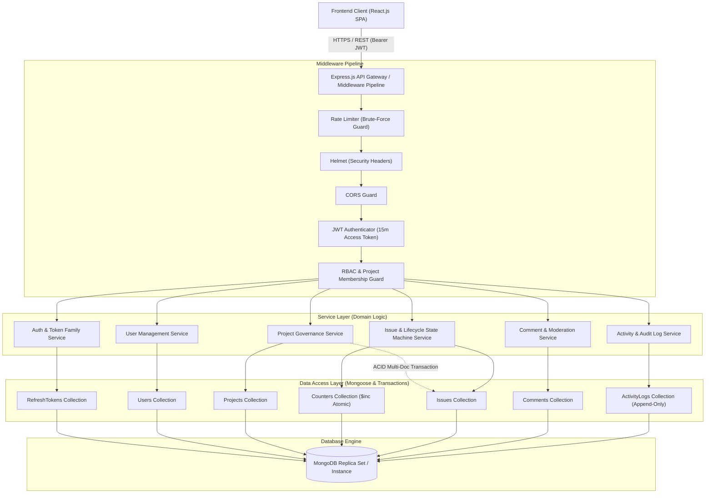
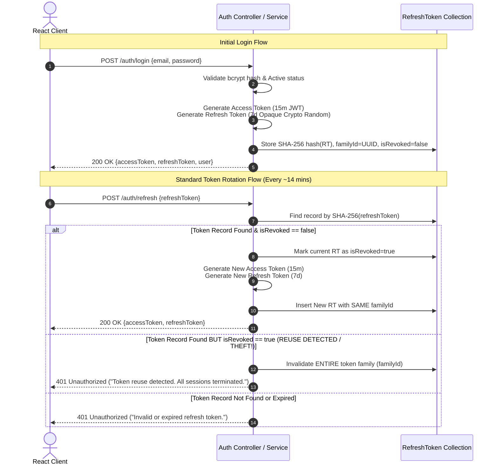
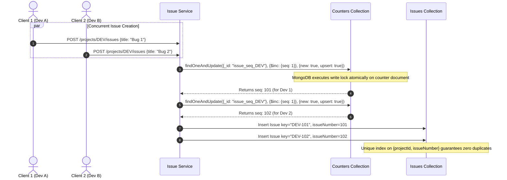

# DevSupport: Developer Issue & Incident Management System
## Phase 2: Database Schema & High-Level Architecture Design

**Document Version:** 2.0.0  
**Status:** Approved for API Specification (Phase 3)  
**Author:** Senior Software Architect & Backend Engineering Lead  
**Authoritative Basis:** Phase 1 Requirements Specification (`DEV-REQ-V1`)  
**Technology Stack:** Node.js, Express.js, MongoDB / Mongoose, React.js, JWT, bcrypt, Docker  

---

## Table of Contents

1. [High-Level Architecture (HLD) & Component Decomposition](#1-high-level-architecture-hld--component-decomposition)
2. [Dual-Token Authentication & Refresh Token Family Strategy](#2-dual-token-authentication--refresh-token-family-strategy)
3. [Database Schema Specifications (Mongoose Modeling)](#3-database-schema-specifications-mongoose-modeling)
   - 3.1 `User` Schema Specification
   - 3.2 `Project` Schema Specification
   - 3.3 `Counter` Schema Specification (Atomic Issue Key Sequence)
   - 3.4 `Issue` Schema Specification
   - 3.5 `Comment` Schema Specification
   - 3.6 `Activity` (Audit Log) Schema Specification
   - 3.7 `RefreshToken` Schema Specification
4. [Atomic MongoDB Counter Pattern & Sequential Issue Key Engine](#4-atomic-mongodb-counter-pattern--sequential-issue-key-engine)
5. [Project-Member Offboarding & Atomic Reassignment Engine](#5-project-member-offboarding--atomic-reassignment-engine)
6. [Data Integrity, Concurrency Control & Indexing Strategy](#6-data-integrity-concurrency-control--indexing-strategy)
7. [Explicit Conflict Analysis & Refinements vs Phase 1](#7-explicit-conflict-analysis--refinements-vs-phase-1)
8. [Placement Interview Defense & System Design Deep Dives](#8-placement-interview-defense--system-design-deep-dives)

---

## 1. High-Level Architecture (HLD) & Component Decomposition

DevSupport follows a **Modular Clean Layered Architecture** with strict boundary segregation between transport, business logic, authorization, and data persistence.



### 1.1 Architectural Layer Responsibilities

1. **API Gateway & Middleware Pipeline:**
   - **CORS & Security:** Prevents cross-origin abuse and injects security headers.
   - **Rate Limiting:** Protects `/api/v1/auth/login`, `/register`, and `/tokens/refresh` against brute-force attacks (5 failed attempts per 15 min per IP).
   - **Authentication Guard:** Decodes and cryptographically verifies the 15-minute Access Token; attaches `req.user = { id, role }`.
   - **RBAC & Tenant Guard:** Evaluates caller role and project membership; verifies caller is enrolled in `req.params.projectId`.

2. **Domain Service Layer:**
   - Pure business logic. Enforces invariants defined in Phase 1: state transitions, issue assignment rules, counter increments, and token rotation.
   - Decoupled from Express request/response objects to guarantee unit testability.

3. **Data Access & Mongoose Layer:**
   - Enforces schema types, validation regexes, compound indexes, and optimistic concurrency versioning (`__v`).
   - Executes multi-document ACID transactions for atomic offboarding and cascading unassignments.

---

## 2. Dual-Token Authentication & Refresh Token Family Strategy

To satisfy User Requirement 3, DevSupport implements an enterprise-grade **Dual-Token with Token Family Rotation and Automatic Reuse Detection**.



### 2.1 Technical Specifications

1. **Access Token (Short-Lived):**
   - **Format:** Stateless JWT signed via HMAC-SHA256 (`HS256`).
   - **Lifetime:** Strict **15 minutes** (`exp: Date.now() + 15 * 60 * 1000`).
   - **Payload Invariants:**
     ```json
     {
       "sub": "651f8a7e3b4a2c001f3e9a11",
       "role": "Developer",
       "iss": "DevSupport-API",
       "iat": 1728000000,
       "exp": 1728000900
     }
     ```

2. **Refresh Token (Long-Lived, Cryptographically Opaque):**
   - **Format:** High-entropy cryptographically random string (e.g., 64 bytes generated via `crypto.randomBytes(64).toString('hex')`).
   - **Lifetime:** **7 days** (`expiresAt: Date.now() + 7 * 24 * 60 * 60 * 1000`).
   - **Storage Protocol (Zero Raw Storage):** The raw refresh token is **never stored** in the database. The database stores the one-way cryptographic hash:
     $$\text{tokenHash} = \text{SHA-256}(\text{rawRefreshToken})$$
   - This ensures that if the database is leaked, an attacker cannot forge refresh requests.

3. **Token Family & Reuse Detection Protocol:**
   - Each login generates a unique `familyId` (UUIDv4).
   - When a valid refresh token is used, it is rotated: the old token is marked `isRevoked: true` and replaced by a child token within the same `familyId`.
   - **Theft Scenario (Reuse Detection):** If a stolen refresh token is used after it has already been rotated (`isRevoked === true`), the system detects an active replay attack. The service executes an immediate bulk update:
     $$\text{UPDATE RefreshToken SET isRevoked = true WHERE familyId = :familyId}$$
     This invalidates the attacker's session and the legitimate user's session, forcing re-authentication.

4. **Automatic MongoDB Eviction:**
   - A MongoDB **TTL (Time-To-Live) index** on `expiresAt` automatically purges expired tokens from disk, keeping the collection lean without cron scripts.

---

## 3. Database Schema Specifications (Mongoose Modeling)

*Note: The following specifications define schema types, validation rules, constraints, references, and indexes conceptually for implementation.*

---

### 3.1 `User` Schema Specification

#### Description
Stores principal user credentials, system-level authorization roles, and account status.

#### Field Definitions
| Field | Type | Required | Constraints & Validation Rules | Default | Description |
| :--- | :--- | :---: | :--- | :---: | :--- |
| `_id` | `ObjectId` | Auto | MongoDB System Primary Key | Auto | Unique User ID |
| `name` | `String` | Yes | Trimmed, min 2, max 60 chars | - | Full name of user |
| `email` | `String` | Yes | Trimmed, lowercase, RFC 5322 regex validation | - | Unique login email |
| `passwordHash` | `String` | Yes | Min length 60 (bcrypt hash output) | - | Secure password hash |
| `role` | `String` | Yes | Enum: `['Admin', 'Team Lead', 'Developer']` | `'Developer'` | System-level RBAC role |
| `status` | `String` | Yes | Enum: `['Active', 'Suspended']` | `'Active'` | Account lifecycle status |
| `lastLoginAt` | `Date` | No | Valid Date | `null` | Timestamp of last auth |
| `createdAt` | `Date` | Auto | ISO 8601 Timestamp | `now` | Record creation time |
| `updatedAt` | `Date` | Auto | ISO 8601 Timestamp | `now` | Record update time |

#### Indexes
- **`{ email: 1 }`** — **Unique Index (Collation: `{ locale: 'en', strength: 2 }`)**. Guarantees system-wide case-insensitive email uniqueness.
- **`{ role: 1, status: 1 }`** — Compound Index. Accelerates administrative user filtering and active user lookups.

#### Invariants & Hooks
- Pre-save invariant: `email` must always be normalized to lowercase.
- Serialization invariant: `passwordHash` must be stripped from all API outputs via Mongoose `transform` / `toJSON`.

---

### 3.2 `Project` Schema Specification

#### Description
Represents the organizational project boundary, its human-readable key, and enrolled membership roster.

#### Field Definitions
| Field | Type | Required | Constraints & Validation Rules | Default | Description |
| :--- | :--- | :---: | :--- | :---: | :--- |
| `_id` | `ObjectId` | Auto | MongoDB System Primary Key | Auto | Unique Project ID |
| `name` | `String` | Yes | Trimmed, min 3, max 80 chars | - | Human-readable project name |
| `key` | `String` | Yes | Uppercase alphanumeric regex: `^[A-Z][A-Z0-9]{1,9}$`, immutable | - | Jira-style prefix (e.g. `DEV`, `PAY`) |
| `description` | `String` | No | Max 1000 chars | `""` | Project scope description |
| `ownerId` | `ObjectId` | Yes | Ref: `'User'` | - | Project Lead / Owner reference |
| `status` | `String` | Yes | Enum: `['Active', 'Archived']` | `'Active'` | Project lifecycle status |
| `members` | `Array` | Yes | Subdocument array of `ProjectMember` | `[]` | Enrolled membership roster |
| `createdAt` | `Date` | Auto | ISO 8601 Timestamp | `now` | Project creation timestamp |
| `updatedAt` | `Date` | Auto | ISO 8601 Timestamp | `now` | Project update timestamp |

#### Subdocument: `ProjectMember`
| Sub-Field | Type | Required | Constraints | Description |
| :--- | :--- | :---: | :--- | :--- |
| `userId` | `ObjectId` | Yes | Ref: `'User'` | Enrolled user ID |
| `projectRole`| `String` | Yes | Enum: `['Lead', 'Developer']` | Role inside this project context |
| `joinedAt` | `Date` | Yes | Valid Date | Timestamp when user was enrolled |

#### Indexes
- **`{ key: 1 }`** — **Unique Index**. Guarantees global uniqueness of project prefix keys.
- **`{ name: 1 }`** — **Unique Index**. Prevents duplicate project names.
- **`{ "members.userId": 1 }`** — Multikey Index. Enables instant lookup of projects where a specific developer is enrolled (`GET /api/v1/projects`).
- **`{ status: 1 }`** — Index. Optimizes filtering active vs archived projects.

#### Invariants
- `key` cannot be mutated after creation (`immutable: true`).
- A project must always have at least one member with `projectRole: 'Lead'` matching or superseding `ownerId`.

---

### 3.3 `Counter` Schema Specification (Atomic Issue Key Sequence)

#### Description
Dedicated collection for atomic, lock-free sequential numbering per project. Decoupling this from the Project document eliminates write-lock contention on the Project record.

#### Field Definitions
| Field | Type | Required | Constraints | Default | Description |
| :--- | :--- | :---: | :--- | :---: | :--- |
| `_id` | `String` | Yes | Format: `issue_seq_<projectId>` | - | Primary Key: Scoped Counter Identifier |
| `projectId` | `ObjectId` | Yes | Ref: `'Project'`, indexed | - | Associated Project ID |
| `seq` | `Number` | Yes | Integer $\ge 0$ | `0` | Current highest sequence number |

#### Indexes
- **`{ _id: 1 }`** — Unique Primary Key.
- **`{ projectId: 1 }`** — Unique Index. Guarantees exactly one counter document per project.

---

### 3.4 `Issue` Schema Specification

#### Description
Atomic unit of engineering defect, task, feature, or production incident tracking.

#### Field Definitions
| Field | Type | Required | Constraints & Validation Rules | Default | Description |
| :--- | :--- | :---: | :--- | :---: | :--- |
| `_id` | `ObjectId` | Auto | MongoDB System Primary Key | Auto | Unique Issue Object ID |
| `key` | `String` | Yes | Format: `PROJECT_KEY-<seq>` (e.g. `DEV-101`) | - | Human-readable Jira-style key |
| `issueNumber`| `Number` | Yes | Positive Integer $\ge 1$ | - | Numeric sequence within project |
| `projectId` | `ObjectId` | Yes | Ref: `'Project'` | - | Parent Project reference |
| `title` | `String` | Yes | Trimmed, min 5, max 150 chars | - | Concise summary of issue |
| `description`| `String` | Yes | Min 10, max 5000 chars | - | Technical details & repro steps |
| `type` | `String` | Yes | Enum: `['Bug', 'Feature', 'Task', 'Incident']` | - | Classification taxonomy |
| `priority` | `String` | Yes | Enum: `['Low', 'Medium', 'High', 'Critical']` | `'Medium'` | Urgency & SLA priority |
| `status` | `String` | Yes | Enum: `['Open', 'In_Progress', 'Resolved', 'Closed', 'Reopened']` | `'Open'` | State machine lifecycle |
| `reporterId` | `ObjectId` | Yes | Ref: `'User'` | - | User who reported the issue |
| `assigneeId` | `ObjectId` | No | Ref: `'User'`, Nullable | `null` | Current owner (`null` = Unassigned) |
| `version` | `Number` | Yes | Integer $\ge 0$ (Optimistic Locking) | `0` | Concurrency version key |
| `createdAt` | `Date` | Auto | ISO 8601 Timestamp | `now` | Issue creation timestamp |
| `updatedAt` | `Date` | Auto | ISO 8601 Timestamp | `now` | Issue update timestamp |

#### Indexes
- **`{ projectId: 1, issueNumber: 1 }`** — **Unique Compound Index**. Critical database-level uniqueness invariant preventing duplicate issue numbers within any project.
- **`{ key: 1 }`** — **Unique Index**. Guarantees global uniqueness of formatted key strings (`DEV-101`).
- **`{ projectId: 1, status: 1, priority: 1, createdAt: -1 }`** — **Compound Index**. Primary query index covering faceted filtering, sorting, and pagination on project issue queues.
- **`{ projectId: 1, assigneeId: 1, status: 1 }`** — **Compound Index**. Accelerates member offboarding checks and developer personal work queues ("My Issues").
- **`{ key: "text", title: "text", description: "text" }`** — **Text Search Index**. Accelerates full-text search parameter `?q=...`.

---

### 3.5 `Comment` Schema Specification

#### Description
Contextual discussion thread items tied to a specific issue.

#### Field Definitions
| Field | Type | Required | Constraints & Validation Rules | Default | Description |
| :--- | :--- | :---: | :--- | :---: | :--- |
| `_id` | `ObjectId` | Auto | MongoDB System Primary Key | Auto | Unique Comment ID |
| `issueId` | `ObjectId` | Yes | Ref: `'Issue'` | - | Target Issue reference |
| `projectId` | `ObjectId` | Yes | Ref: `'Project'` | - | Parent Project (for query scoping) |
| `authorId` | `ObjectId` | Yes | Ref: `'User'` | - | Author user reference |
| `content` | `String` | Yes | Min 1, max 3000 chars | - | Comment text / Markdown |
| `isEdited` | `Boolean` | Yes | Boolean | `false` | Mutation flag |
| `createdAt` | `Date` | Auto | ISO 8601 Timestamp | `now` | Timestamp when posted |
| `updatedAt` | `Date` | Auto | ISO 8601 Timestamp | `now` | Timestamp of last edit |

#### Indexes
- **`{ issueId: 1, createdAt: 1 }`** — Compound Index. Supports chronological rendering of issue comment streams.
- **`{ authorId: 1 }`** — Index. Supports user activity tracking.

---

### 3.6 `Activity` (Audit Log) Schema Specification

#### Description
Strictly immutable, append-only chronological history of all domain mutations.

#### Field Definitions
| Field | Type | Required | Constraints & Validation Rules | Default | Description |
| :--- | :--- | :---: | :--- | :---: | :--- |
| `_id` | `ObjectId` | Auto | MongoDB System Primary Key | Auto | Unique Audit Log ID |
| `entityType` | `String` | Yes | Enum: `['Issue', 'Project', 'Comment']` | - | Target domain entity type |
| `entityId` | `ObjectId` | Yes | Reference to target entity | - | Specific Target ID |
| `projectId` | `ObjectId` | Yes | Ref: `'Project'` | - | Parent Project scoping ID |
| `actorId` | `ObjectId` | Yes | Ref: `'User'` | - | User who performed the mutation |
| `actionType` | `String` | Yes | Enum (Catalog below) | - | Domain event identifier |
| `details` | `Object` | Yes | Embedded payload `{ oldValue, newValue, reason }` | `{}` | Contextual delta payload |
| `createdAt` | `Date` | Auto | ISO 8601 Timestamp | `now` | Timestamp of event occurrence |

#### Allowed `actionType` Catalog
- `ISSUE_CREATED`, `STATUS_CHANGED`, `ASSIGNEE_CHANGED`, `PRIORITY_CHANGED`, `ISSUE_UPDATED`
- `COMMENT_ADDED`, `COMMENT_DELETED`
- `PROJECT_MEMBER_ADDED`, `PROJECT_MEMBER_REMOVED`, `PROJECT_ARCHIVED`

#### Indexes
- **`{ entityId: 1, createdAt: -1 }`** — Compound Index. Powers the timeline tab on issue detail pages.
- **`{ projectId: 1, createdAt: -1 }`** — Compound Index. Powers the project-wide activity stream.

#### Immutability Guard
- Mongoose schema must prohibit `findByIdAndUpdate`, `updateOne`, `deleteMany`, and `deleteOne` operations. This collection is append-only by design.

---

### 3.7 `RefreshToken` Schema Specification

#### Description
Stores one-way hashed refresh tokens with family tracking and automated TTL expiration.

#### Field Definitions
| Field | Type | Required | Constraints & Validation Rules | Default | Description |
| :--- | :--- | :---: | :--- | :---: | :--- |
| `_id` | `ObjectId` | Auto | MongoDB System Primary Key | Auto | Unique Token Record ID |
| `userId` | `ObjectId` | Yes | Ref: `'User'` | - | Associated user ID |
| `tokenHash` | `String` | Yes | 64-char Hex String (SHA-256 output) | - | Cryptographic hash of token |
| `familyId` | `String` | Yes | UUIDv4 format | - | Session family lineage ID |
| `isRevoked` | `Boolean` | Yes | Boolean | `false` | Invalidation flag |
| `expiresAt` | `Date` | Yes | Date (Now + 7 Days) | - | Expiration timestamp |
| `createdAt` | `Date` | Auto | ISO 8601 Timestamp | `now` | Creation timestamp |

#### Indexes
- **`{ tokenHash: 1 }`** — **Unique Index**. Enables sub-5ms token lookup during rotation requests.
- **`{ familyId: 1 }`** — Index. Powers atomic family revocation upon token reuse detection.
- **`{ expiresAt: 1 }`** — **TTL Index (`expireAfterSeconds: 0`)**. MongoDB background thread automatically purges expired records from disk.

---

## 4. Atomic MongoDB Counter Pattern & Sequential Issue Key Engine

Generating human-readable sequential issue keys (e.g. `DEV-101`, `DEV-102`) across distributed Express API processes requires lock-free concurrency safety.

### 4.1 The Concurrency Problem
A naive implementation:
```javascript
// ANTIPATTERN: Race condition under concurrent requests!
const count = await Issue.countDocuments({ projectId });
const issueKey = `${project.key}-${count + 1}`;
```
If two developers submit an issue simultaneously, both read `count = 100`, and both attempt to create `DEV-101`, causing collision errors.

### 4.2 The Atomic `$inc` Engine Architecture

DevSupport solves this using MongoDB's atomic document-level modification operator:



### 4.3 Database-Level Guarantees
1. **Atomic Sequence Generation:** The counter increment is executed via:
   - Filter: `{ _id: "issue_seq_<projectId>" }`
   - Update: `{ $inc: { seq: 1 }, $setOnInsert: { projectId: projectId } }`
   - Options: `{ returnDocument: 'after', upsert: true }`
2. **Double-Safety Net:** Even if an unexpected server crash or rollback occurs, the **unique compound index** on `{ projectId: 1, issueNumber: 1 }` prevents duplicate records from ever being committed to the database.

---

## 5. Project-Member Offboarding & Atomic Reassignment Engine

Per the user's explicit decision, project-member removal enforces a **Strict Guard** by default and provides an **Atomic Resolution Transaction** for explicit transfers or unassignments.

### 5.1 Offboarding Decision Flowchart

```mermaid
flowchart TD
    Start([DELETE /projects/:id/members/:userId]) --> CheckOpenQuery[Query Issues: projectId = :id, assigneeId = :userId,<br/>status IN ['Open', 'In_Progress', 'Reopened']]
    
    CheckOpenQuery --> HasOpen{Open Issues Count > 0?}
    
    HasOpen -- No --> ExecuteDirectRemoval[Remove user from project.members array<br/>Log PROJECT_MEMBER_REMOVED<br/>Return 200 OK]
    
    HasOpen -- Yes --> CheckBodyStrategy{Did caller provide<br/>explicit strategy in body?}
    
    CheckBodyStrategy -- "No Strategy Provided (Default)" --> RejectGuard[400 Bad Request: MEMBER_HAS_ACTIVE_ISSUES<br/>Return payload with blockingIssues list]
    
    CheckBodyStrategy -- "strategy = 'unassign'" --> StartUnassignTx[Begin MongoDB Multi-Doc Transaction]
    StartUnassignTx --> UnassignIssues[UPDATE Issues SET assigneeId = null<br/>WHERE id IN blockingIssueIds]
    UnassignIssues --> LogUnassignAudit[INSERT Activity logs for each issue: ASSIGNEE_CHANGED]
    LogUnassignAudit --> RemoveMemberTx1[PULL user from project.members]
    RemoveMemberTx1 --> CommitTx1[Commit Transaction -> Return 200 OK]
    
    CheckBodyStrategy -- "strategy = 'transfer'" --> ValidateNewMember{Is transferToUserId an active<br/>member of this project?}
    ValidateNewMember -- No --> RejectInvalidUser[422 Unprocessable Entity: INVALID_TRANSFER_TARGET]
    ValidateNewMember -- Yes --> StartTransferTx[Begin MongoDB Multi-Doc Transaction]
    StartTransferTx --> TransferIssues[UPDATE Issues SET assigneeId = transferToUserId<br/>WHERE id IN blockingIssueIds]
    TransferIssues --> LogTransferAudit[INSERT Activity logs for each issue: ASSIGNEE_CHANGED]
    LogTransferAudit --> RemoveMemberTx2[PULL user from project.members]
    RemoveMemberTx2 --> CommitTx2[Commit Transaction -> Return 200 OK]
```

### 5.2 Offboarding Error Envelope (Default Guard)
When removal is attempted without resolving assigned work, the API blocks the operation:
```json
{
  "success": false,
  "error": {
    "code": "MEMBER_HAS_ACTIVE_ISSUES",
    "message": "Cannot remove member with active assigned issues. Choose 'transfer' or 'unassign' strategy.",
    "details": {
      "activeCount": 2,
      "blockingIssues": [
        { "id": "651f8a7e3b4a2c001f3e9a44", "key": "DEV-104", "title": "Crash on login checkout", "status": "In_Progress" },
        { "id": "651f8a7e3b4a2c001f3e9a55", "key": "DEV-109", "title": "Memory leak in socket handler", "status": "Open" }
      ]
    },
    "timestamp": "2026-10-04T01:25:00.000Z"
  }
}
```

### 5.3 Transactional Guarantees
- MongoDB multi-document transactions (`client.startSession()` / `session.startTransaction()`) guarantee that:
  - If issue updates succeed but member roster removal fails, the entire transaction rolls back.
  - No issues are left in an indeterminate or partially assigned state.
  - Every affected issue receives an immutable `ASSIGNEE_CHANGED` audit record inside the exact same atomic transaction boundary.

---

## 6. Data Integrity, Concurrency Control & Indexing Strategy

### 6.1 Optimistic Concurrency Control (OCC)
In high-velocity engineering teams, two developers may attempt to update an issue's status or priority simultaneously:
1. Developer A loads issue `DEV-101` at `version = 3`.
2. Developer B loads issue `DEV-101` at `version = 3`.
3. Developer A transitions status to `In_Progress` $\rightarrow$ Database updates record and increments `version` to `4`.
4. Developer B submits a transition to `Resolved` with expected `version = 3`.
5. **OCC Protection:** The Mongoose update query specifies `{ _id: issueId, version: 3 }`. Since the record is now at `version = 4`, zero documents are modified.
6. The service layer catches the collision and returns `409 Conflict` (`"The issue was modified by another user. Please refresh and retry."`).

### 6.2 Master Indexing Strategy Matrix

| Collection | Index Definition | Type | Architectural Justification |
| :--- | :--- | :---: | :--- |
| **`users`** | `{ email: 1 }` | Unique | Enforces case-insensitive login email uniqueness globally. |
| **`users`** | `{ role: 1, status: 1 }` | Compound | Fast administrative filtering of active staff. |
| **`projects`** | `{ key: 1 }` | Unique | Prevents collision of issue prefix keys (`DEV`, `PAY`). |
| **`projects`** | `{ name: 1 }` | Unique | Prevents duplicate project naming. |
| **`projects`** | `{ "members.userId": 1 }` | Multikey | Instant retrieval of projects for enrolled user dashboards. |
| **`counters`** | `{ projectId: 1 }` | Unique | Guarantees single counter sequence per project. |
| **`issues`** | `{ projectId: 1, issueNumber: 1 }` | Unique Compound | **Core Invariant:** Guarantees absolute sequential uniqueness within projects. |
| **`issues`** | `{ key: 1 }` | Unique | Enables direct lookup by formatted key (`DEV-101`). |
| **`issues`** | `{ projectId: 1, status: 1, priority: 1, createdAt: -1 }` | Compound | Covers primary filtered/sorted issue queue queries without in-memory sorting. |
| **`issues`** | `{ projectId: 1, assigneeId: 1, status: 1 }` | Compound | Fast offboarding check and developer "My Tickets" queue. |
| **`issues`** | `{ key: "text", title: "text", description: "text" }` | Text | High-performance full-text search (`?q=...`). |
| **`comments`** | `{ issueId: 1, createdAt: 1 }` | Compound | Fast chronological loading of ticket conversation feeds. |
| **`activity_logs`** | `{ entityId: 1, createdAt: -1 }` | Compound | Powers reverse-chronological issue activity streams. |
| **`activity_logs`** | `{ projectId: 1, createdAt: -1 }` | Compound | Powers project-wide audit timeline. |
| **`refresh_tokens`**| `{ tokenHash: 1 }` | Unique | Instant token verification during refresh requests. |
| **`refresh_tokens`**| `{ familyId: 1 }` | Secondary | Immediate invalidation of all sessions on token reuse detection. |
| **`refresh_tokens`**| `{ expiresAt: 1 }` | TTL | Automatic MongoDB garbage collection of expired session tokens. |

---

## 7. Explicit Conflict Analysis & Refinements vs Phase 1

In accordance with strict architectural governance, we analyze differences between Phase 1 and Phase 2:

| Dimension | Phase 1 Baseline Requirement | Phase 2 Architectural Refinement | Conflict or Enhancement? | Rationale & Resolution |
| :--- | :--- | :--- | :---: | :--- |
| **Authentication Tokens** | Single stateless JWT (8h–24h lifespan). | Dual-Token architecture: 15-min Access Token + 7-day Refresh Token with family rotation and SHA-256 storage. | **Enhancement (User Decision 3)** | Resolves the security weakness of long-lived access tokens. Stolen access tokens expire in 15 minutes; refresh tokens cannot be abused without triggering automated reuse detection. |
| **Issue Identifier** | Abstract human-readable key suggested (`PROJ-101`). | Formalized Jira-style `PROJECT_KEY-<sequential number>` powered by a dedicated `counters` collection and atomic `$inc`. | **Refinement (User Decision 1)** | Decoupling the counter into a dedicated collection prevents document-level write-lock contention on the Project record during high-frequency ticket creation. |
| **Member Removal Protocol** | Strict guard suggested with optional batch resolution. | Strict Guard enforced as default (`400 Bad Request` with blocking issue array). Atomic multi-document MongoDB transaction required for `transfer` or `unassign`. | **Refinement (User Decision 2)** | Guarantees absolute consistency. Eliminates the risk of partial failures where a member is removed while some issues remain unassigned. |
| **Audit Log Storage** | Conceptual append-only collection. | Formalized Mongoose schema with schema-level prevention of `update` and `delete` hooks. | **Enhancement** | Hardens audit compliance at the data access layer against accidental programmatic mutations. |

*Conclusion:* No business logic regressions or contradictions exist. All refinements strictly advance the security, concurrency, and integrity of Phase 1 requirements.

---

## 8. Placement Interview Defense & System Design Deep Dives

### 8.1 Why not embed the issue counter inside the Project document?
- **Candidate Defense:**
  - In MongoDB, updating a field in a document places a write lock on that specific document.
  - If 50 developers across an enterprise create issues in the same project simultaneously, updating `project.issueCounter` causes lock contention on the Project document.
  - By isolating sequences in a dedicated `counters` collection (`_id: "issue_seq_<projectId>"`), the Project document remains available for concurrent reads and metadata updates without contention.

### 8.2 How does the Refresh Token Family prevent Session Hijacking?
- **Candidate Defense:**
  - If an attacker intercepts a raw refresh token and the legitimate user uses it first, the attacker's attempt uses an already rotated token (`isRevoked: true`).
  - If the attacker uses it first, the legitimate user's subsequent attempt uses the revoked token.
  - In either sequence, the server detects that a revoked token from that `familyId` was submitted.
  - Rather than treating it as a standard failure, the server executes an immediate emergency revocation of all tokens sharing that `familyId`, terminating the session for both parties and neutralizing the breach.

### 8.3 Why store the SHA-256 hash of refresh tokens instead of bcrypt?
- **Candidate Defense:**
  - Refresh tokens are generated by `crypto.randomBytes(64)` and possess $\approx 512$ bits of cryptographic entropy. Unlike human-chosen passwords, high-entropy tokens are mathematically immune to dictionary attacks.
  - Bcrypt introduces deliberate CPU-intensive work factors (cost 12 takes $\approx 250\text{ ms}$). Doing this on every token refresh under heavy traffic degrades API throughput.
  - SHA-256 is cryptographically one-way, executes in microseconds, and provides complete protection: even if the database is leaked, raw tokens cannot be recovered.

### 8.4 How do MongoDB Multi-Document Transactions work without degrading performance?
- **Candidate Defense:**
  - MongoDB supports ACID transactions across collections using WiredTiger storage engine write-intent locks.
  - We restrict transactions exclusively to multi-entity mutations: member offboarding with bulk ticket reassignments.
  - Standard issue reads, status transitions, and comments operate on single-document atomic operations, maintaining maximum read/write throughput for 99% of system traffic.

---

## 9. Phase Sign-off & Transition to Phase 3

Phase 2 (Database Schema & High-Level Architecture Design) is complete and fully documented.

**Ready for Next Stage:**
- **Phase 3:** RESTful API Specification (OpenAPI Route Contracts, Request/Response Payloads, Controller Signatures, and HTTP Status Codes).
